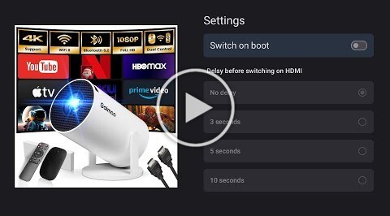

# HDMI Switch

An Android TV app that automatically selects the HDMI input source on device boot for the Gaimoo GM200 projector.

## Description

This Android TV application is designed to simplify the user experience for projector owners, particularly those using the Gaimoo GM200. The app's primary function is to automatically switch the projector's input source to HDMI upon device boot. Additionally, it offers a configurable delay before switching, allowing users to customize the timing of the HDMI selection.

## How It Works

The app operates by leveraging the following Android system features:

1.  **Boot Completion Detection:** The app registers a `BroadcastReceiver` to listen for the `android.intent.action.BOOT_COMPLETED` event. This event is triggered when the Android TV device has finished booting up.
2.  **Alarm Scheduling:** Upon detecting the boot completion event, the app uses the `AlarmManager` to schedule a task to run after a configurable delay. This delay can be set by the user in the app's settings.
3.  **Intent Dispatch:** When the scheduled alarm triggers, the app sends an `Intent` to the `AWLiveTV` application (`com.softwinner.awlivetv`). This `Intent` contains instructions to switch the input source to HDMI.
4.  **App Availability Check:** Before sending the `Intent`, the app checks if the `AWLiveTV` application is installed on the device. If it's not found, the app displays an error message to the user, indicating that the HDMI switching functionality cannot be performed.
5. **Permissions**: The app requires the following permissions:
    * `android.permission.RECEIVE_BOOT_COMPLETED`: To receive the boot completed event.
    * `android.permission.SCHEDULE_EXACT_ALARM`: To schedule an exact alarm.
6. **Queries**: The app uses the `<queries>` tag in the `AndroidManifest.xml` to check if the `AWLiveTV` application is installed.

## Compatibility

This app has been specifically tested and confirmed to work on the **Gaimoo GM200** projector based on **Android 11**. However, it may also be compatible with other projectors that utilize the `AWLiveTV` application (`com.softwinner.awlivetv`) for managing input sources. If you have a similar projector, feel free to try it out and report your findings!

## Installation

You can install the application in two ways:
1. **Developer Options and ADB:** Enable developer options on your projector (see https://www.youtube.com/watch?v=MXT7d5IBIag), then connect to it using ADB (`adb connect <ip>`) and install the APK (`adb install <apk_file>`).
2. **USB Sideloading:** Copy the APK to a USB storage device, connect it to your projector, and use the file manager to locate and install the APK.

## Configuration

The app allows you to:

*   **Enable/Disable HDMI Switch on Boot:** You can easily turn the automatic HDMI switching feature on or off.
*   **Set a Delay:** You can configure a delay (in seconds) before the HDMI input is selected after boot. This can be useful if you need to wait for other devices to initialize.

## Disclaimer

**Use this app at your own risk.** The developers of this app are not responsible for any malfunctions, damages, or issues that may arise from the use of this application on your device. While the app has been tested on the Gaimoo GM200 projector, compatibility with other devices is not guaranteed. Always exercise caution when using third-party applications on your devices.

## Contributing

Contributions are welcome! If you find a bug or have a suggestion for improvement, please open an issue or submit a pull request.
